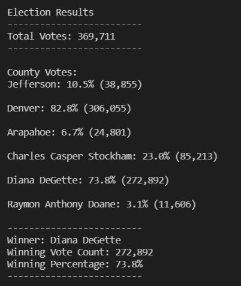

# Election_Analysis

## Overview of Elecction Audit
The Election Commission in Denver, Colorado has asked for assistance creating a script to help automate the process of determining the winning candidate of the election and the total number of votes in each county. This is accomplsihed through a python script that takes in a .csv file and returns the values in the terminal as well as exporting the information to a .txt file. The election results and voting totals are listed below. 
## Election-Audit Results

- How many votes were cast in this congressional election?

        Total Votes =  369,711
- Provide a breakdown of the number of votes and the percentage of total votes for each county in the precinct.

        County Votes:

        Jefferson: 10.5% (38,855)
        Denver: 82.8% (306,055)
        Arapahoe: 6.7% (24,801)

- Which county had the largest number of votes?

        Denver: 82.8% (306,055)

- Provide a breakdown of the number of votes and the percentage of the total votes each candidate received.

        Candidate Votes:
        
        Charles Casper Stockham: 23.0% (85,213)
        Diana DeGette: 73.8% (272,892)
        Raymon Anthony Doane: 3.1% (11,606)

- Which candidate won the election, what was their vote count, and what was their percentage of the total votes?

        Diana DeGette: 73.8% (272,892)
        
- Below is the results from the terminal when the script is run. 

        

## Election-Audit Summary  
This script is a simple, automated way to quickly calculate election totals for each candidate and total votes casat tin each county. The script calls for a .csv file with 3 columns: Ballot ID, County, and Candidate. The Ballot ID column is not used, but it is good to have a unique identifier for each vote. Since the script only looks at the county and candidate columns, it would be simple to reformat the script to look at the same columns in different locations or to format a .csv file to run in this script. This makes it ideal to use in all future elections. This code can be modified in a few ways to make it run even better for furture elections.   
